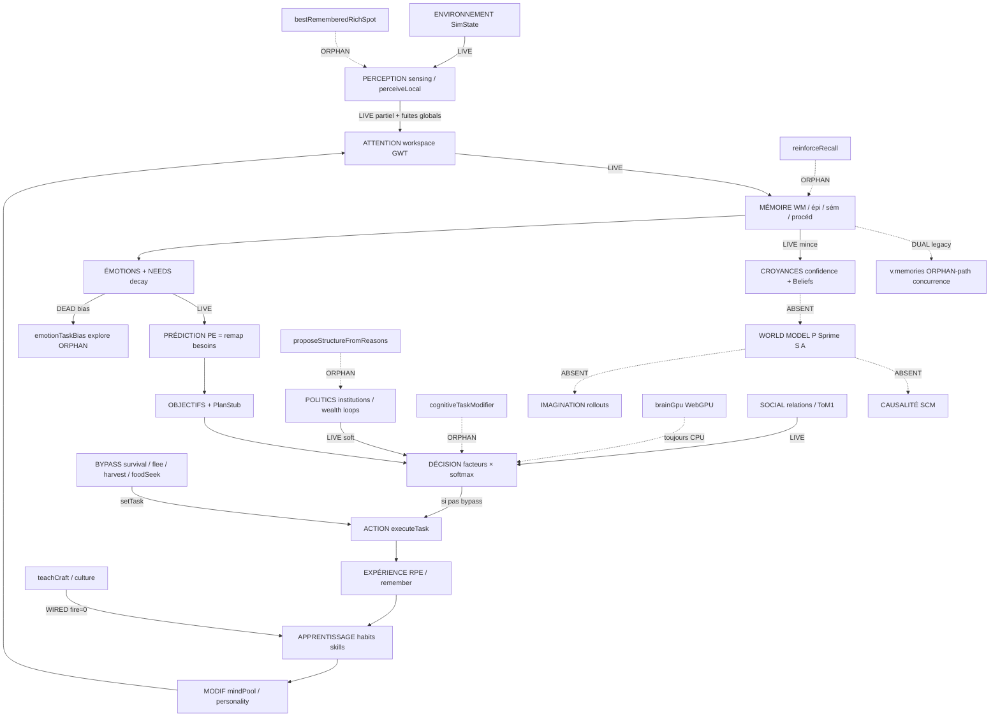

# BRAIN_COHERENCE_REPORT

**PM :** Agent 6  
**Sources :** Agents 1 (math §1–10), 2 (mémoire §11–16), 3 (affect §17–24), 4 (social §25–40), 5 (architecture §41 / phases 0–18)  
**Date :** 2026-09-15  
**Workspace :** `village_edit` (`nolan-work`)  
**Périmètre de ce tour :** synthèse uniquement — **aucune correction code**, **aucune sim longue**, **aucune perf**.

---

## 1. Verdict exécutif (10 lignes max)

1. Le « cerveau hybride mathématique » n’est **pas** encore un système unique : c’est une **FSM de survie scriptée** (`behaviors.ts`) avec un **sidecar cognitif** (facteurs × softmax, besoins, émotions, GWT, RPE).
2. **Réel et branché :** décision multi-facteurs + Boltzmann (`decide.ts`), pile hiérarchique habit→skill→goal→plan stub, mémoires multi-stores, attention urgence/nouveauté, émotions/besoins continus (decay), graphes de relations, institutions émergentes (pas de `CREATE_X`), boucles richesse→influence, conscience GWT privée, teach/culture (câblés).
3. **Marketing / noms trompeurs :** « Bayesian », « predictive / homeostatic PE », « causal chronicle », « plan », LA/PCA, WebGPU — souvent des scalaires, LUT, ou libellés UI.
4. **Colonne vertébrale (§41) :** WorldModel lite 1-step + imagination top-3 + model PE = **Wave B DONE** ; SCM / MCTS / deep rollouts still absent.
5. **Autorité cassée :** `tryAssignSurvivalTask` / food seek / ripe harvest / flee **battent** le softmax sur le chemin critique.
6. **Orphelins morts :** `cognitiveTaskModifier`, `proposeStructureFromReasons`, `bestRememberedRichSpot`, `reinforceRecall` ; biais émotion `explore` (TaskKind inexistant) ; WebGPU → toujours CPU.
7. **État fragmenté :** pas de `BrainState` unifié — `Villager` + `CognitiveState`/`mindPool` + `politics`.
8. **Dualités :** `v.memories` vs mind episodic/semantic ; `profession` vs `livelihood` ; `ambition` vs `goal` ; fuites d’omniscience (crise / globals).
9. **Patches gameplay** (vague interrompue 61d879c8 : A1 harvest, C1/C2 lights, mobilier/moulin/gear/fort/teach, chronicle, close-up, tradeLinks, …) : **présents potentiellement dans le worktree — validation Agent 7 obligatoire ; ne pas les revertir ici.**
10. **Verdict PM :** GO Wave A (câblage / autorité / orphelins) après lecture OK utilisateur — **pas** de vague maths formelles vanity.

---

## 2. Carte du tout (système unique)

Légende : **LIVE** = flux réel vers `chooseTask`/`executeTask` · **ORPHAN** = code mort · **ABSENT** = jamais construit · **BYPASS** = hard override qui court-circuite le cerveau.

**Règle de cohérence (prompt Nolan) :**

| Mécanisme | Indépendant IRL OK ? | Statut cohérence |
|---|---|---|
| Génétique / physique corps | Oui (biologie séparée) | OK en silo relatif |
| Softmax + facteurs + RPE + GWT + mémoire + émotions | Non — doivent former **un** cerveau | **Partiel** : interconnectés mais **bypassés** |
| Politics / institutions | Semi — émergent des individus | **Partiel** : parallèle, multipliers soft |
| WorldModel / Causality / Imagination | Non — spine prédictive | **ABSENT** = trou du système |
| Orphelins listés | Non | **Dead silos** à brancher ou supprimer |
| Formal Bayes/HMM/PCA/MCTS/Pareto/SIR | Optionnel plus tard | **Ne pas** ajouter en silo vanity |

---

## 3. Tableau master §§1–40

Statuts consolidés. En cas de conflit entre agents → préférence **ABSENT / ORPHAN / PARTIAL honnête**.

| # | Status | Wired? | Interconnects with | Priority | Note |
|---|---|---|---|---|---|
| 1 Linear algebra / PCA | PARTIAL | Oui (facteurs) | decide, ethnos, mindPool | P3 | Produits scalaires + SoA — **pas** PCA/embeddings |
| 2 Dynamical systems / ODE | PARTIAL | Oui | emotions, needs, tick | P2 | Decay discret — **pas** ODE |
| 3 Stochastic / Markov | PARTIAL | Oui | decide softmax T | P2 | Boltzmann réel ; pas Markov/Poisson |
| 4 Bayesian P(H\|E) | PARTIAL→ABSENT* | Partiel | memory conf, ToM, Beliefs | P2 | *Honnêteté : blends heuristiques, pas Bayes |
| 5 BN / HMM / filters | ABSENT | Non | — | P3 | Pas d’inférence concurrente |
| 6 Decision theory | PRESENT | Oui | chooseTask, goals, executive | P0 | Fort mais **bypassé** par survival |
| 7 RL / RPE habits | PARTIAL | Oui | recordTaskOutcome → habits | P1 | Lite OK ; pas Q-table |
| 8 Hierarchical learning | PRESENT | Oui | tactics→habit→skill→goal→plan | P1 | Plans = stubs HTN fixes |
| 9 Game theory | PARTIAL | Oui soft | tom, politics reciprocate | P3 | Trust/heuristics ≠ Nash |
| 10 Information theory | ABSENT | Non | — | P3 | Pas entropy/MI/KL |
| 11 Multi-store memory | PRESENT | Oui | tick, remember, decide | P0 | Dual `v.memories` vs mind |
| 12 Decay + consolidation | PARTIAL | Oui / ORPHAN | rest consolidate ; `reinforceRecall` mort | P0 | Brancher rehearsal |
| 13 Attention | PRESENT | Oui | workspace → consciousAccessBias | P1 | Urgence ≠ QKV (OK) |
| 14 World model local | PARTIAL | Oui + fuites | sensing, crises findNearest | P0 | Omniscience crise / globals |
| 15 Model of others | PARTIAL | Oui | socialModel, relations | P1 | Scalaires ; fuites `mindOf` |
| 16 ToM nested 1–3 | PARTIAL | Oui (depth 1) | tomActionBias | P2 | Depth 2–3 **ABSENT** |
| 17 Emotions dynamical | PARTIAL | Oui + dead path | emotionTaskBias | P0 | Bias `explore` mort |
| 18 Homeostasis / PE | PARTIAL | Oui | needs → PE remap | P1 | Labels « active inference » overclaim |
| 19 Curiosity IG | PARTIAL | Oui | personality → invent/wander | P2 | Trait ≠ information gain |
| 20 Exploration UCB | PARTIAL | Oui | softmax T | P2 | Pas UCB/Thompson |
| 21 Imagination rollouts | PARTIAL | Oui (1-step) | decide top-3 | P1 | Wave B — **pas** MCTS |
| 22 P(S'\|S,A) | PARTIAL | Oui lite | predictive estimate | P1 | Heuristique succès/danger ; pas transition full |
| 23 Causality SCM | ABSENT | Non (log only) | logCause UI | P2 | Chronicle « → » ≠ SCM |
| 24 Counterfactuals | ABSENT | Non | — | P2 | — |
| 25 Relation graphs | PRESENT | Oui | social, politics, decide | P1 | Ego-maps OK |
| 26 Network science | PARTIAL | Oui soft | circles, gossip | P3 | Pas centralité/PageRank |
| 27 Pop dynamics SIR/LV | PARTIAL | Oui ABM | ecology, births | P3 | Carrying ≠ SIR/LV |
| 28 Evolutionary algorithms | PARTIAL | Oui bio/culture | genetics, habits | P3 | Pas EA de politiques |
| 29 Cultural dynamics | PRESENT | Oui | ethnos, creeds, teach | P1 | Axes croyances fixes |
| 30 Self-org / no CREATE_X | PRESENT | Oui | politics, religion | P1 | Seuils soft restent |
| 31 Feedback wealth→influence | PRESENT | Oui | politics, gear | P1 | — |
| 32 Pareto multi-obj | ABSENT | Non | decide scalarize | P3 | Softmax ≠ frontière Pareto |
| 33 Irrationality / prospect | PARTIAL | Oui soft | T, emotions, S1 | P3 | Pas prospect theory |
| 34 Personality vector | PRESENT | Oui | decide, drift | P2 | Drift très lent |
| 35 Social learning / teach | PRESENT | Wired / fire≈0 | teachCraft, guilds | P0 | Fire-rate critique gameplay |
| 36 Generative language | PARTIAL | UI/ethnos | thoughts templates | P3 | Pas speech-acts intent→utterance |
| 37 Drive conflicts | PARTIAL | Oui soft | WM competition | P0 | Survival hard kill soft conflict |
| 38 GWT consciousness | PRESENT | Oui | workspace → decide + UI | P1 | Fort layer |
| 39 Metacognition / self-doubt | PARTIAL | Tags only | confidence memory | P3 | Pas metacontrol policy |
| 40 Autobiographical memory | PARTIAL | Oui | episodes, revenge, spots | P2 | Caps courts ; arcs faibles |

\*§4 : Agent 1 = PARTIAL (scalaires) ; PM consolide **PARTIAL (faux Bayes)** — ne pas traiter comme couche Bayes réelle.

---

## 4. Phases 0–18 maturity + ordre de build recommandé

| Phase | Maturity | Lecture PM |
|---|---|---|
| 0 Infra | **DONE** | engine / worker / RNG / logs |
| 1 État interne | **PARTIAL** | Pas de `BrainState` unifié ; soif/douleur absents |
| 2 Perception | **PARTIAL** | Radar local + fuites globales |
| 3 Mémoire | **PARTIAL** | Multi-store OK ; dual legacy ; rehearsal orphan |
| 4 Croyances | **SKELETON** | Confidence / Beliefs ≠ Bayes |
| 5 Émotions / motivations | **PARTIAL** | Continues + LUT ; explore bias mort |
| 6 Objectifs | **PARTIAL** | Goals/plans vs ambition/profession |
| 7 Décision | **PARTIAL** | Softmax réel **dominé** par hard assigns |
| 8 World model | **MISSING** | Trou spine |
| 9 Apprentissage | **SKELETON** | RPE/skills seulement |
| 10 Apprentissage social | **PARTIAL** | Teach câblé, fire≈0 |
| 11 Relations | **DONE** (lite) | Graphes vivants |
| 12 ToM | **SKELETON** | Ordre 1 seulement |
| 13 Planif / imagination | **SKELETON** | PlanStub ; pas rollouts |
| 14 Évolution | **PARTIAL** | Génétique/culture ; pas EA stratégies |
| 15 Émergence collective | **PARTIAL** | Institutions OK ; seuils lourds |
| 16 Auto-organisation | **SKELETON** | Feedbacks scalaires |
| 17 Optimisation | **PARTIAL** | LOD/SoA ; WebGPU stub |
| 18 Architecture finale | **SKELETON** | Modules `cognition/` + `behaviors.ts` enchevêtrés |

### Prochaines 3–5 tranches de cohérence (UN système — pas tout le maths d’un coup)

1. **Autorité unique de décision (P0)** — démotiquer hard overrides (`tryAssignSurvivalTask`, food seek, ripe harvest, flee gates) en **facteurs / priorités** dans `decide.ts` ; survival reste fort mais passe par le même pipeline.
2. **Unifier l’état (P0)** — façade / `BrainState` (ou doc+API unique) : Villager body ↔ mindPool ↔ politics ; une source de vérité pour mémoire lieux, goal vs ambition, profession vs livelihood.
3. **Brancher les orphelins utiles / tuer les morts (P0)** — `reinforceRecall` sur recall décisionnel ; `bestRememberedRichSpot` dans sensing/gather ; fixer ou supprimer `emotionTaskBias` `explore` ; décider du sort de `cognitiveTaskModifier` / `proposeStructureFromReasons`.
4. **Fermer le stub WorldModel lite (P1)** — 1-step `P(S'|S,A)` **heuristique** (succès/échec local + spots) → nourrit PE/goals — **pas** MCTS/Bayes vanity.
5. **Fire-rate social learning (P0 gameplay↔cerveau)** — faire tirer `teachCraft` / diffusion ; sinon §35 reste décoratif.

*(Optionnel parallèle non-bloquant : patches AUDIT_SHARED déjà en worktree — Agent 7 valide.)*

---

## 5. Conflits & bugs de cohérence (à corriger plus tard)

1. **Survival hard-assign vs softmax** — chemin critique hors cerveau math.
2. **Dual mémoire** — `v.memories` + mind episodic/semantic ; biais lieux peuvent diverger.
3. **Profession vs livelihood** — deux identités de travail.
4. **Ambition vs goals/PlanStub** — intention long terme double.
5. **Beliefs politics vs mind.values / selfModel** — creed/identité fragmentée.
6. **Omniscience leaks** — crise `findNearest` large, prix pain / SoL globaux, `mindOf(other)` culture vraie.
7. **Marketing names** — predictive, Bayesian, causal, plan, LA, WebGPU.
8. **Dead explore bias** — émotions poussent un `TaskKind` inexistant.
9. **teach wired, teachCount≈0** — émergence culturelle invisible en run.
10. **WorldModel ↔ Causality ↔ Imagination** — triangle §41 vide (spine cassée).
11. **Option menu authored** — softmax ne fait que ranger un catalogue `if/add` dans `behaviors.ts`.
12. **Patches vague 61d879c8** — état worktree partiel ; **pending validation Agent 7** (ne pas revert).

---

## 6. Plan de correction pour la vague suivante

### Wave A — cohérence wiring (orphelins, chemins morts, autorité unique)

- [x] A1. Inventaire call-sites : orphelins §Agent5 + `reinforceRecall` + bias `explore`.
- [x] A2. Décision : brancher **ou** supprimer chaque orphelin (pas de demi-mesure).
  - `reinforceRecall` → `decide.placeMemoryFactor` + `sensing.senseResource` / `spotMemoryBias`
  - `bestRememberedRichSpot` → `chooseTask` forage path
  - `cognitiveTaskModifier` → `decide.ts` + soft flee/fight bias
  - `proposeStructureFromReasons` → live via `maybeProposeConstruction`
- [x] A3. Démotion hard overrides → facteurs / gates soft documentés (survival reste prioritaire mais **dans** `pickTaskByPolicy`).
  - SOFT : ripe harvest / mild rest via `survivalUrgency` + `harvestUrgency` ; night/exhaustion/storm housed demoted
  - HARD résiduel OK : eat-with-food, empty-bag crisis forage, outdoor freeze/torch ; flee assign + soft fight↔flee
- [x] A4. Unifier autorité mémoire lieux (legacy vs semantic) pour gather/flee.
  - `knownSpots` mind-first ; legacy fallback si vide ; `mirrorMindSpotsToLegacy` deep tick ; idle via `bestRememberedRichSpot`
- [x] A5. Align ambition↔goal et profession↔livelihood (une écrit, l’autre dérive ou alias).
  - `syncAmbitionAndGoal` bidir ; `syncProfessionLivelihood` ; livelihood softProfession → profession
- [x] A6. Fix fire-rate `teachCraft` / teachKnowledge (seuils, scoring, bloqueurs).
- [x] A7. Remplacer biais `explore` mort par `idle`/wander/`experiment` réel.
- [x] A8. Documenter honnêtement BRAIN_SIM_SCHEMA (retirer overclaims predictive/causal).
- [x] A9. Ne pas toucher perf / WebGPU (sauf note « CPU only »).

**Statut Wave A :** **CLOSED** — Agent 7 medium diagnose **PASS** (0 deaths seed1/7 ; harvest+teach fire ; whyRate=1.0). **Wave B = COMPLETE.**

### Wave B — remplir ABSENT spine **seulement s’ils connectent**

- [x] B1. World model **lite** 1-step (prédiction locale succès tâche / danger spot) → PE / scoring.
  - `estimateTaskOutcome` + `predictedOutcome` / `modelPredictionError` on `CognitiveState`
  - Heuristique skills / knownSpots / habits / recent rate / affect → `storePredictedOutcome` at decide + hard assigns
- [x] B2. Imagination **1-step** (comparer 2–3 actions candidates via modèle lite) — **pas** MCTS profond.
  - `pickTaskByPolicy` : top-2/3 utilities × `outcomeUtilityMult` avant softmax ; whyFactors `imagination ±%`
- [x] B3. Meilleur PE : erreur = attendu modèle − observé (pas simple remap needs).
  - `recordModelPredictionError` in `recordTaskOutcome` ; PE channel `task_model` ; bleed into `prefsSkillFactor`
- [x] B4. Interdit Wave B : full Bayes, HMM, PCA, Pareto, SIR, prospect theory, ToM depth 3, LLM.

**Statut Wave B :** **COMPLETE** (B1–B3 wired ; B4 respected).

### Wave C — gameplay survie / civ (AUDIT_SHARED)

- [ ] C1. Après Wave A (ou parallèle si non-conflit) : valider / finir patches A1 harvest, mill/bread, furniture, gear, fort, lights, chronicle, tradeLinks, close-up…
- [x] C2. Agent 7 : sims seed 1/7 → `AGENT7_SIM_REPORT.md` **PASS**
- [x] C3. PM tranche : Wave A closed ; **Wave B GO** ; pas de hotfix A

**Agent 7** = medium diagnose **PASS** (2026-09-15).

---

## 7. Ce qu’on NE fait PAS maintenant

- Pas d’optimisation perf / WebGPU réel.
- Pas de full Bayes / HMM / Kalman / PCA / MCTS / Pareto / SIR / LV vanity.
- Pas de `CREATE_RELIGION` / `CREATE_KINGDOM` / opcodes institutionnels.
- Pas de LLM-as-brain.
- Pas de sims longues (réservé Agent 7).
- Pas de revert des patches gameplay en cours sans preuve Agent 7.
- Pas d’implémentation « toutes les maths du prompt » d’un coup.

---

## 8. Sign-off PM

| Question | Réponse |
|---|---|
| Cerveau = un tout interconnecté ? | **Mieux** — Wave A + Wave B spine lite (1-step WM / imagination / model PE) |
| Wave A | **CLOSED** — Agent 7 **PASS** |
| Agent 7 medium (40j) | **PASS** — seed1/7 : **0 deaths** ; harvestWheat 11/342 ; teachCraft 100/317 ; **whyRate=1.0** |
| Wave B ? | **COMPLETE** (B1–B3 ; B4 respected) |
| Hotfix bandits | **COMPLETE** — no camp TP ; outlaw conversion preferred ; raids steal-lite ; probe seed7 PASS (`BANDIT_FIX_NOTE.md`) |
| Hotfix Wave A cerveau | **Aucun** (Agent 7 PASS) |
| Sims 90j / civ audit | Optionnel |

**Recommandation PM :** Wave A + Wave B + hotfix bandits **CLOSED**. Pas de nouvelle vague cerveau ouverte.

---

*Fin BRAIN_COHERENCE_REPORT — Agent 6*
