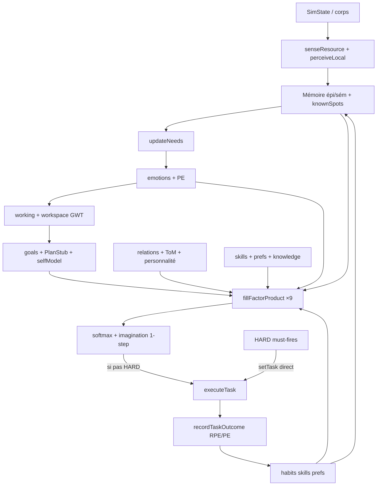

# BRAIN_CYCLE_REPORT — Connectivité du cerveau PNJ

**Pour :** Nolan  
**Date :** 2026-09-16  
**Workspace :** `village_edit`  
**Sources :** `BRAIN_COHERENCE_REPORT.md`, `AUDIT_A2_BRAIN.md`, `cognition/tick.ts`, `cognition/decide.ts`, `behaviors.ts` (chooseTask / executeTask)

---

## 1. Verdict

Le cerveau PNJ forme **un système de décision hybride interconnecté** : perception → mémoire → besoins/émotions → buts/plan → espace de travail/conscience → matrice de facteurs × softmax → action → RPE/habitudes/savoir-faire → mémoire.

Ce n’est **pas** un FSM de survie pure ni une collection de silos décoratifs. Les modules cognitifs **entrent dans** `pickTaskByPolicy` (9 facteurs). En revanche, des **HARD must-fires** biologiques (manger avec nourriture, crise sac vide, gel dehors, menace combat) **court-circuitent** le softmax quand la mort est imminente — documentés et acceptables, pas des orphelins.

**Verdict :** **CONNECTÉ (hybride)** — cycle mental continu sur le chemin soft ; survie HARD résiduelle volontaire. Vague Wave A/B déjà fermée ; ce passage renforce des fils encore faibles (stress↔buts, personnalité sociale, savoir déclaratif, rappel localisé).

---

## 2. Tableau des étapes du cycle

Légende : **PRESENT** = câblé vers decide/action · **PARTIAL** = réel mais mince / dual / LOD · **ABSENT** = jamais construit · **ORPHAN** = code mort · **BYPASSED** = HARD script saute le cerveau.

| Étape | Statut | Preuves (fichiers) | Influence | Lacunes |
|---|---|---|---|---|
| **PERCEIVE** | PRESENT | `sensing.ts` (`senseResource`), `tick.ts` (`perceiveLocal`), `behaviors.ts` senseOpts | Catalogue d’options + sémantique `market_high` / loups / SoL | Fuites globales crise (`findNearest` large) ; LOD blind search |
| **UNDERSTAND** | PARTIAL | `workspace.ts`, `consciousness.ts`, `workingMemory.ts`, `predictive.ts` | `workspaceBias` / `consciousAccessBias` / PE dans `needsFactor` | Pas de SCM / pas de vraie inférence ; imagination = 1-step lite |
| **REMEMBER** | PRESENT | `memory.ts` (épi/sém/procéd), `onRemember`, `knownSpots`, `reinforceRecall` | `placeMemoryFactor`, spots gather/flee, consolidation repos | Dualité `v.memories` ↔ mind (autorité mind-first) |
| **FEEL** | PRESENT | `emotions.ts`, `needs.ts`, `tick.ts` decay | Facteur `emotions` + T softmax + stress→habitude | Pas d’ODE ; axes valence/approche heuristiques |
| **EVALUATE** | PRESENT | `goals.ts` (`scoreGoals`/`pickGoal`/`goalTaskModifier`), `selfModel.ts`, `stubs` culture/religion | Facteur `valeurs_plan` + ambition/métier | Plans = HTN stubs fixes ; ambition encore miroir |
| **DECIDE** | PRESENT | `decide.ts` `fillFactorProduct` → `pickTaskByPolicy` | Softmax Boltzmann sur utilités × imagination top-3 | HARD bypass avant/après ; catalogue `if/add` authored |
| **ACT** | PRESENT | `behaviors.ts` `executeTask` | Monde / inventaire / combat / craft | Mid-tick interrupts peuvent re-assigner |
| **OBSERVE CONSEQUENCES** | PRESENT | `recordTaskOutcome`, `noteChosenAction`, `estimateTaskOutcome` | PE modèle + RPE → stress/habitudes | Prédiction = heuristique locale, pas P(S′\|S,A) riche |
| **LEARN** | PRESENT | habits RPE, `practiceSkill`, `reinforcePreference`, knowledge tech | Facteurs `stress_habitude` + `prefs_savoir` au **prochain** chooseTask | Pas de Q-table ; teach fire-rate encore fragile gameplay |
| **REPEAT** | PRESENT | `tickVillager` → cognition → choose/execute loop | Vie mentale continue (fast/deep) | Deep LOD budgété ; pas tous les agents deep chaque tick |
| **Personality** | PRESENT | `v.personality` → needs/values/T/lieu/social (ce pass) | Courage/curiosité/sociabilité/générosité dans facteurs | Drift très lent |
| **Knowledge** | PARTIAL→PRESENT | `technology.ts` + `prefsSkillFactor` (ce pass) | teach/craft/build/mine soft | Bits rares ; pas tous les crafts mappés |
| **Skills** | PRESENT | `memory.skillBonus` / practice | Facteur prefs_savoir + vitesse/yield exécution | Rust léger |
| **Relations / ToM** | PRESENT | `tom.ts`, `socialTomFactor`, `v.relations` | socialise/giveFood/confront/defend/teach | ToM depth 1 only |
| **Reflection** | PARTIAL | `selfModel`, `buildReasons`, `consolidateOnRest`, conscience | Biais but/tâche + UI « pourquoi » | Pas de métapolicy de réflexion séparée |
| **Consciousness / GWT** | PRESENT | `competeForWorkspace` → `consciousAccessBias` | Multiplie besoins alignés (pas garnish) | Stream deep seulement ; asleep/dream → biais 0 |

---

## 3. Flux réel (tick vivant)

```
tickVillager
  ├─ mid-tick interrupts (eat / chest / empty-bag / ripe leisure / cold / threat)
  │     HARD setTask  ──ou──  soft via cognitiveTaskModifier (fight↔flee)
  ├─ si pas de tâche :
  │     forceBiologicalRhythm  → HARD survie / homeless freeze
  │     sinon tickCognition(fast|deep) + chooseTask
  │           perceiveLocal (deep)
  │           needs / emotions / WM / workspace / consciousness
  │           goals + plan + selfModel + ToM (deep)
  │           catalogue options (env + memory spots)
  │           [HARD] bagEmptyFoodCrisis → tryAssignFoodSeek
  │           pickTaskByPolicy : 9 facteurs × softmax × imagination 1-step
  │           setTask + noteChosenAction (forecast PE)
  └─ executeTask
        recordTaskOutcome → skills / prefs / habits / RPE / model PE / plan advance
        → mindPool sync → prochain tick
```

### Mermaid



### ASCII

```
PERCEIVE → UNDERSTAND(WM/GWT/PE) → REMEMBER → FEEL(needs/emo)
    → EVALUATE(goals/plan/self) → DECIDE(facteurs×softmax)
    → ACT → OBSERVE(RPE/model PE) → LEARN(habits/skills/prefs/knowledge)
    → REPEAT
         ↑________________HARD survival/threat may short-circuit DECIDE____|
```

---

## 4. Bypasses HARD (sautent le cerveau soft)

| Bypass | Où | Raison | Soft ailleurs ? |
|---|---|---|---|
| Eat avec nourriture + faim | `tryAssignSurvivalTask`, mid-tick | Mort sac plein | Oui : `survivalUrgency` / needsFactor eat |
| Empty-bag crisis forage | `bagEmptyFoodCrisis` + `tryAssignFoodSeek` | Starvation sans panier | Oui : damp idle/rest + boost gather |
| Outdoor freeze / homeless storm | `forceBiologicalRhythm`, cold interrupt | Pas d’option abri sans maison | Soft rest pour housed |
| Torche nuit dehors | survival HARD | Gel/obscurité | light/warmth needsFactor |
| Fight/flee menace | `nearestTacticalThreat` | Doit agir | **SOFT** choix fight↔flee via `cognitiveTaskModifier` |
| Soft-AFK streak ≥3 | re-pick / food / harvest | Anti-plaza-nap | Re-softmax sans idle/rest |
| Ripe harvest mid-tick leisure | `tryAssignRipeHarvest` | Moisson vs chat | Soft `harvestUrgency` au chooseTask |

**Non-bypass (démotionnés Wave A) :** repos confort nuit, fatigue housed, orage chez soi, moisson ripe au chooseTask — passent par facteurs.

---

## 5. Matrice des 9 facteurs (autorité soft)

| # | Facteur | Sources |
|---|---|---|
| 0 | besoins | needs + survivalUrgency + harvestUrgency + WM/GWT/PE |
| 1 | valeurs_plan | goalTaskModifier + boost plan sous stress (ce pass) |
| 2 | émotions | emotionTaskBias (TaskKinds réels) |
| 3 | stress_habitude | habits × S1/stress ; plan step protégé (ce pass) |
| 4 | prefs_savoir | prefs + skills + culture + selfModel + **knowledge** (ce pass) + model PE |
| 5 | social_tom | ToM + relations + **personnalité** générosité/sociabilité (ce pass) |
| 6 | politique | politicalTaskBias × executiveInhibit |
| 7 | métier_ambition | jobBonus × ambitionBonus (+ livelihood overlay) |
| 8 | lieu_mémoire | burrow + religion + spots + **reinforceRecall local** (ce pass) |

---

## 6. Correctifs appliqués ce passage

1. **Buts sous stress** — `valuesPlanFactor` + `stressHabitFactor` : l’étape active du plan garde un plancher soft sous S1/stress (plus « habits only »).
2. **Personnalité dans social_tom** — sociabilité → socialise/teach ; générosité → giveFood ; courage/générosité → confront/steal.
3. **Knowledge → decide** — `knowledgeCount` / `hasKnowledge` biaisent teachCraft, craft, fortification, blast mining dans `prefsSkillFactor`.
4. **reinforceRecall localisé** — rappel ne renforce plus tous les épisodes du kind, seulement ceux près du lieu utilisé (`near` x/y/r).
5. **Émotions → TaskKinds vivants** — stress/valence → forage/moisson/pêche ; pride/affection → teachCraft ; approachAvoid damp teach aussi.
6. **Combat HARD + why cognitif** — fight/flee enregistrent les mults `cognitiveTaskModifier` dans `lastFactorWhy`.

Fichiers touchés : `cognition/decide.ts`, `cognition/memory.ts`, `cognition/emotions.ts`, `cognition/sensing.ts`, `behaviors.ts`.

---

## 7. Lacunes restantes (honnêtes)

1. **HARD survie** reste hors softmax (voulu) — whyFactors absents sur eat/chest/torch directs.
2. **Dual mémoire** legacy `v.memories` encore miroir ; divergence possible si legacy seule écrite.
3. **ToM depth ≥2 ABSENT** ; impressions scalaires.
4. **World model** = lite 1-step (Wave B) — pas MCTS / Bayes / SCM.
5. **Reflection** = selfModel + reasons UI, pas boucle métacognitive séparée.
6. **Teach/culture fire-rate** gameplay encore fragile (câblé, volume variable).
7. **WebGPU** label backend possible ; chemin réel CPU (`batchSoftmaxSelect`).
8. **Catalogue authored** — le cerveau score un menu `add(...)`, il n’invente pas de TaskKinds.

---

## 8. Sign-off

| Question | Réponse |
|---|---|
| Un seul système de décision ? | **Oui (hybride)** — facteurs × softmax + HARD biologiques |
| Modules en silo / garnish ? | **Non** sur le chemin soft (GWT, émotions, ToM, habits, knowledge branchés) |
| Orphelins Wave A (`explore`, `reinforceRecall`, `cognitiveTaskModifier`, …) ? | **Fermés** ; rappel encore renforcé (local) ce pass |
| Prochaine priorité cerveau ? | Optionnel : whyFactors sur HARD survival ; unifier écriture mémoire lieux ; fire-rate teach |
| Vanity Bayes/MCTS ? | **Non ajouté** (interdit) |

*Fin BRAIN_CYCLE_REPORT — audit + fixes connectivité*

---

## Second pass

**Agent :** second audit (verify + remaining disconnects)  
**Date :** 2026-09-16  
**Method :** Re-read live `behaviors.ts` / `cognition/*` against this report’s claims; close 1–2 open cycle gaps.

### Claim verification (first-pass report vs code)

| Claim (first pass) | Status |
|---|---|
| Soft path: perceive→…→learn closed via `tickCognition` + `pickTaskByPolicy` + `recordTaskOutcome` | **Verified** |
| HARD must-fires: eat / empty-bag / freeze / torch / threat fight|flee | **Verified** (still present) |
| Wave A orphans wired (`reinforceRecall`, `cognitiveTaskModifier`, explore→idle/experiment) | **Verified** |
| Wave B 1-step WM / imagination / model PE | **Verified** |
| Goals under stress keep plan-step floor (`valuesPlanFactor` / `stressHabitFactor`) | **Verified** |
| Personality in `socialTomFactor` | **Verified** |
| Knowledge → `prefsSkillFactor` | **Verified** |
| Localized `reinforceRecall(..., near)` | **Verified** |
| Emotions → live TaskKinds (incl. teachCraft / forage) | **Verified** |
| Fight/flee `lastFactorWhy` with cognitive mults | **Verified** |
| Diagram note `perceiveLocal (deep)` only | **Was true; fixed this pass** |

### Loop status

`perceive → memory → feel → evaluate → decide → act → learn` is **closed** on the soft rethink path after the fixes below. HARD residual list in §4 still skips evaluate→decide by design; learn remains wired via `noteChosenAction` + `recordTaskOutcome`.

### Remaining HARD bypasses (unchanged intent)

1. Eat with food in bag  
2. Empty-bag crisis forage (`tryAssignFoodSeek`)  
3. Chest pull when hungry + stocked  
4. Outdoor night torch  
5. Outdoor freeze / homeless collapse  
6. Threat fight/flee assign (which one soft-biased)  
7. Night / storm / cold / exhaustion shelter for labor & exposure  
8. Soft-AFK streak ≥ 3 (food / ripe / re-softmax)  
9. Post-chest → eat  

### Fixes applied this second pass

1. **`tickCognition`:** `perceiveLocal` now runs on **fast and deep** (was deep-only) so perceive→feel stays fresh every think.  
2. **Idle cooldown:** exhausted / home-night no longer silent `setTask(rest)` — forces `tickCognition` + `chooseTask`.  
3. **Mid-tick leisure night (calm):** plaza/social → null + rethink (soft) instead of HARD bed; storm/cold/exhaust/night labor stay HARD.

Files touched (2nd pass): `cognition/tick.ts`, `behaviors.ts`.

### Residual risk (not fixed)

- Blanket **night HARD rest** still aborts non-leisure outdoor labor (`(!onCaravan && night)`). Softening that is a gameplay call.  
- HARD survival assigns still lack full whyFactors (as noted in §7).
