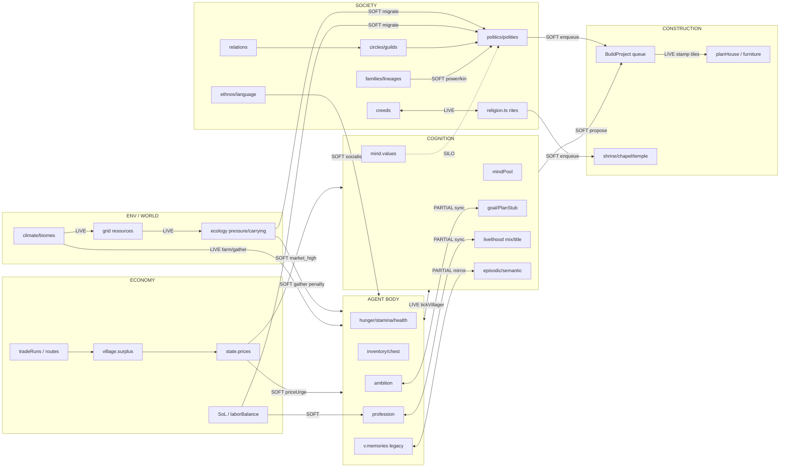

# INTERCONNECT AUDIT

**Workspace:** `village_edit`  
**Date:** 2026-09-16  
**Sources:** TOTAL_AUDIT_MASTER, BRAIN_COHERENCE_REPORT, careers.ts, ecology.ts, commerce.ts, behaviors.assignProfession, politics.ts, religion.ts, A6/A7/A8–10/A11 audits  
**Rule:** NO new features — merge / unify / wire only.

---

## Verdict

The sim is **not one coherent organism yet**. Many modules already exchange soft multipliers, but several **authoritative state duals** and **global-oracle pipes** still make villages, brains, jobs, and society feel like parallel silos. Dynamic careers and local famine→migration are partial wins; task choice, leisure, and some social ticks still disagreed with career demand until this pass.

**Applied this pass (high-value wire):** unified famine feel (`feelFamine` / `villagerFeelsFamine`) across chooseTask, decide leisure gates, needs, livelihood services, profession stickiness, price bias, cognition famine emotion, disease, reproduction, marriage — matching careers demand. Document remaining TOP 8 for the fix team.

---

## 1. System map — how they talk

Legend: **LIVE** bidirectional feedback · **SOFT** one soft multiplier · **ONE-WAY** write→rarely read · **SILO** parallel / dual authority · **ORPHAN** dead code path

### Tick spine (`engine.stepSimulation`)

| Order | System | Talks to |
|------:|--------|----------|
| 1 | climate | fields, cold/heat, biome muls |
| 2 | tickFamine → `state.famine` | **global** flag (still authoritative for world chronicle) |
| 3 | commerce (economy/SoL/prices) | surplus → prices → attractiveness |
| 4 | tickVillager (chooseTask + execute) | mind, profession, livelihood, politics bias |
| 5 | trade / marriage / reproduction / fields | economy + family |
| 6 | animals / combat / bandits / regrowth | threat → guard demand / cohesion |
| 7 | tickPolitics (+ religion world) | circles, migration, construction intents |
| 8 | tickBuildProjects | material spend → tiles / security |
| 9 | technology / lineages / ethnos | teach, inheritance memory, culture |

### Major pipes (status)

| From → To | Status | Mechanism |
|-----------|--------|-----------|
| ecology famine → careers | **LIVE** | `feelFamine` in `computeCareerDemand` |
| ecology famine → chooseTask / leisure | **LIVE (fixed this pass)** | was global-only |
| surplus → prices → grind/bake/trade | **LIVE** | A6 `priceUrge` + `market_high` |
| prices → construction materials urgency | **SOFT / thin** | buyMaterial afford; build scores barely price-led |
| profession → tasks | **LIVE** | `jobBonus` |
| livelihood practice → profession | **PARTIAL** | softProfession retitle + review lock |
| ambition ↔ goal | **PARTIAL** | `syncAmbitionAndGoal` deep tick |
| politics beliefs → task bias | **LIVE** | `politicalTaskBias` |
| religion.ts ↔ politics creeds | **LIVE** | crystallise + rites + shrine builds |
| mind.values ↔ politics.beliefs | **SILO** | both exist; weak coupling via `valuesFromPersonality` seed only |
| family wealth → politics power | **SOFT** | kin counts / inheritance; not full household economy |
| carrying pressure → migration | **LIVE** | politics + commerce attractiveness |
| construction → economy | **ONE-WAY soft** | security/dev bump; rarely reprice demand |
| teachCraft → culture/tech | **LIVE (A8–10)** | was fire≈0; now fires |

---

## 2. Duplicated / dual state

Severity: **P0** must unify · **P1** alias or single writer · **P2** document-only OK short term

| Dual | Where | Severity | Reality |
|------|-------|----------|---------|
| `state.famine` vs `villageInFamine` | ecology, behaviors, politics, commerce | **P0 → partially repaired** | Careers already OR'd; chooseTask/leisure/repro still global-only → now `feelFamine`/`villagerFeelsFamine`. Chronicle + market clearing still use global flag (OK as world pulse). |
| `v.memories` vs mind episodic/semantic | social + cognition | **P1** | Wave A mirrored spots; dual stores remain — risk of divergent place bias if mirror skips. |
| `profession` vs `livelihood` | Villager + mindPool | **P1** | Sync + softProfession exist; titles (prêtre/gourou) live only in livelihood while enum métier is separate. |
| `ambition` vs `mind.goal` / PlanStub | Villager + cognition | **P1** | Bidirectional sync on deep ticks; chooseTask still scores `v.ambition` directly in many branches. |
| `politics.beliefs` vs `mind.values` / selfModel | politics + cognition | **P1** | Creed/piety authority is politics; values used in decide — can diverge after circle socialization. |
| religion: `tickReligionDepth` (stubs) vs `religion.ts` | cognition/stubs + religion | **P1** | Both crystallise creeds / sacred sites. Overlap OK if one owns shrine builds (religion.ts) and stub owns sacredConf — **document ownership**, avoid double creed assign races. |
| wealth proxies | `estimateWealth`, `wealthProxy`, SoL, gearPrestige | **P2** | Multiple rankings → inequality / power / inheritance can disagree. |
| food stores | village.surplus vs chests vs inventories | **P2** | Intentional layers; ensure famine/career use same basket (careers ≈ ecology villageFoodStores). |
| security | `village.security` vs recomputed `villageSecurity()` | **P2** | Fort builds write security; careers fallbacks recompute — fine if always refreshed in commerce tick. |

---

## 3. One-way pipes & silent data

| Pipe | Severity | Notes |
|------|----------|-------|
| Global famine broadcast into leisure while local village starving ignored | **P0 fixed** | A11-7 residual; closed for decision surface |
| `market_high` / prices → buildHouse / furniture / walls | **P1** | Prices move craft/trade; civic builds mostly ambition/need, not scarcity |
| `laborBalance` → assignProfession | **P1** | Pulls migration & construction bias; does **not** directly reweight profession scores (careers uses SoL/surplus instead) |
| `pooledFood` on hunger circles | **SOFT LIVE** | Biases giveFood; does not restock village surplus |
| Family `familyId` / lineages | **PARTIAL** | Birth/marriage/adoption attach; many NPC loops still use spouse/parentIds only |
| `relativeWealth` / ecology rank | **ONE-WAY?** | Confirm all call sites affect decide — some audit paths write ranks for UI only |
| Construction project reasons | **SOFT** | Chronicle + enqueue; abandoned projects weak feedback into mind goals |
| Bandit inequalityStress → careers.guardNeed | **SOFT** | Threat counts wolves/bandits nearby; inequality → bandits, not directly guard demand |
| Teach → ethnos identity | **THIN** | Tech bits move; creed/ethnos identity slow |
| Omniscience: crisis `findNearest` food, distant SoL compare | **P1 leak** | A11 open — not interconnection merge but breaks local sensing coherence |
| Hearthes craft-chain limited | **P1** | A7 residual — build↔survival loop incomplete |

---

## 4. TOP 8 interconnection repairs (merge/unify/wire)

Ordered for **one sim**, no feature creep.

| # | Severity | Repair | Why | Touch |
|---|----------|--------|-----|-------|
| **1** | **P0** | **Single famine feel API everywhere** | Careers already local+global; leisure/tasks/repro disagreed → incoherent crisis response | `ecology.feelFamine` ✅ applied to chooseTask, decide, needs, livelihood, politics stickiness/price, mind emotion, disease, marriage/repro. **Still audit:** commerce `famineFood` price bump, bandits, ethnos keys, politicalTaskBias share_famine branches that still read `state.famine` only |
| **2** | **P0** | **One work-identity writer** | Profession review vs livelihood softProfession can thrash or ignore demand | Make `applyProfessionChange` the only mutator; livelihood calls it; demand vector consulted before soft retitle |
| **3** | **P0** | **Ambition/goal single authority in scoring** | chooseTask hard-codes `v.ambition` while mind.goal drives factors — two intents | Prefer `mind.goal` (+ sync) in option scores; keep ambition as personality label or strict alias |
| **4** | **P1** | **Beliefs ↔ values sync or façade** | Politics socializes beliefs; decide uses values — identity split | Deep-tick soft pull values←beliefs (or one `IdentityState`) |
| **5** | **P1** | **Religion ownership** | stubs + religion.ts both crystallise | Keep creed crystallisation in religion/politics only; stubs only update sacredConf/emotions |
| **6** | **P1** | **laborBalance → career demand** | Vic3 employment unused by assignProfession | Add idle/shortage term into `computeCareerDemand` (wire, not new job types) |
| **7** | **P1** | **Prices → civic/material builds** | Scarcity should pull stone/wood gathers for projects | Reuse `priceUrge` on project-related gather/build options when `state.projects` pending |
| **8** | **P1** | **Family household economy loop** | Families exist but pantry/share mostly spouse/affinity | Hunger-circle share + giveFood already; wire familyId peers into share_famine / inheritance wealth → power (unify wealth proxy) |

### Explicitly defer (not TOP 8)

- WorldModel/MCTS vanity maths  
- WebGPU  
- New creeds / jobs / buildings  
- Full civil war  

---

## 5. Quick wires applied (this session)

1. **`ecology.ts`:** `feelFamine`, `villagerFeelsFamine`  
2. **`careers.ts`:** demand uses `feelFamine`  
3. **`behaviors.ts`:** chooseTask famine local+global; craft gate; leisure interrupt; disease; reproduction per-couple  
4. **`cognition/decide.ts` + `needs.ts` + `tick.ts`:** leisure block, hunger need, famine emotion  
5. **`politics.ts`:** profession lock-in + politicalPriceBias + migration famineFeel  
6. **`livelihood.ts` + `marriage.ts`:** service/teach gates; marriage/adoption local feel  

**Not done (fix team):** remaining raw `state.famine` in commerce price clearing, bandits, ethnos, some politics task-bias norm multipliers — convert to `feelFamine(state, vg)` / `villagerFeelsFamine` for consistency (repair #1 completion).

---

## 6. Suggested fix-team sequence

1. Grep `state.famine` → replace decision-time reads with feel helpers (keep tickFamine writer).  
2. Profession mutator monopoly + demand gate on softProfession.  
3. Collapse ambition scoring onto goal.  
4. Religion stub de-dup.  
5. laborBalance into careers vector.  
6. priceUrge on project gathers.  
7. Memory dual: assert mirror every deep tick; eventually read mind-only.  
8. Re-run A6/A11/career probes multi-seed.

---

## 7. Evidence anchors

- Careers demand already documented: `DYNAMIC_CAREERS.md`, `CAREER_DEMAND_NOTES.md`  
- Brain duals: `BRAIN_COHERENCE_REPORT.md` §5, Wave A5 sync  
- Famine split: `AUDIT_A11_WORLD.md` A11-2 fixed migration; A11-7 leisure/cognition residual  
- Economy price loop: `AUDIT_A6_ECON.md`  
- Society creed/teach: `AUDIT_A810_SOC.md`  
- Construction: `AUDIT_A7_BUILD.md`  

---

*End of interconnect audit.*