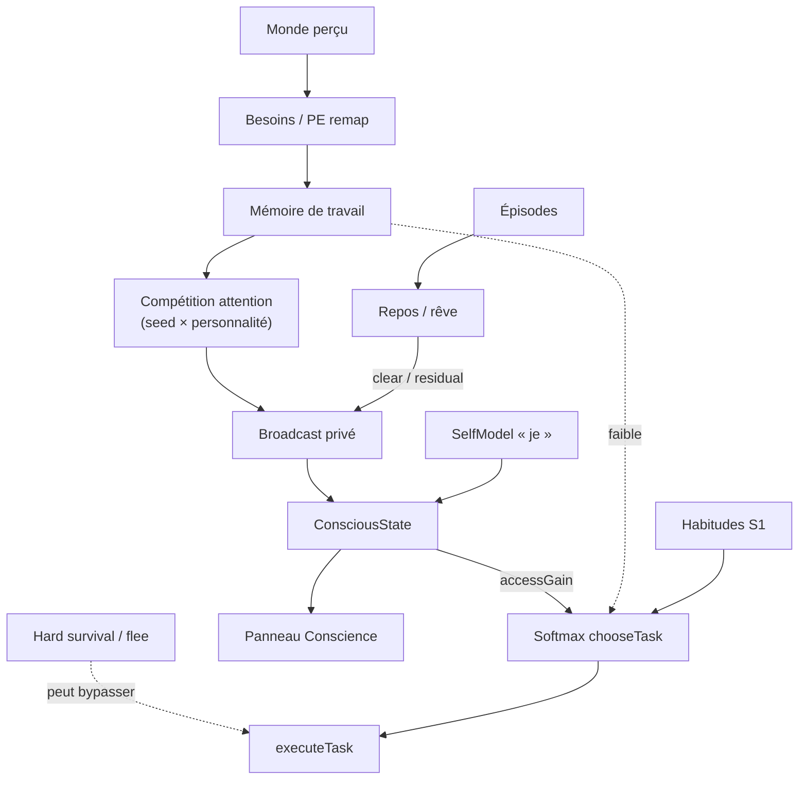

# Schéma Brain-Sim → village-sim

Adaptation **honnête** de concepts Wikipedia *Brain simulation* / GWT à une sim d’agents Electron/TS.
**Ce n’est pas** Blue Brain, NEST, NEURON, ni une émulation connectome.

## Niveaux

| Niveau neuro / brain-sim | Village-sim | Statut |
| --- | --- | --- |
| Hodgkin–Huxley / compartiments | — | **NON** |
| Point neurons / spiking (NEST) | — | **NON** |
| Connectome / colonnes corticales | — | **NON** |
| Architectures cognitives (Spaun-like) | `cognition/` | **OUI** (lite) |
| Global Workspace (Baars/Dehaene) | `workspace.ts` + `consciousness.ts` | **OUI** (accès lite) |
| Dual-process S1/S2 | `executive.ts` `processMode` | **OUI** (lite) |
| Prédiction / interoception | `predictive.ts` | **OUI lite** — needs remap + Wave B model PE (`expected − observed`) |
| Modèle du monde / causal / imagination | `predictive.ts` + `decide.ts` | **OUI lite** — 1-step heuristic + top-3 imagination ; **pas** SCM / MCTS |
| RPE / apprent. habitudes | `recordTaskOutcome` + mindPool | **OUI** (habits lite) |
| Mémoires épi / sém / procéd. | `memory.ts` | **OUI** (+ rehearsal via `reinforceRecall`) |
| Sélection d’action (softmax) | `decide.ts` → `chooseTask` | **OUI** — survival hard-assign peut encore préempter |
| Theory of Mind | `tom.ts` | **OUI** (1er ordre seulement) |
| Contrôle exécutif | `executiveInhibit` | **OUI** |
| Consolidation sommeil | `consolidateOnRest` | **OUI** |
| Conscience individuelle | `ConsciousState` privé / esprit | **OUI** |
| Backend WebGPU softmax | `kernels/brainGpu.ts` | **CPU only** (stub GPU) |
| Cortex LLM | — | **NON** (interdit) |

## Conscience individuelle (priorité)

Inspirée de la *Global Workspace Theory* et du self phénoménal — **implémentable**, pas mystique.

1. Chaque esprit (`CognitiveState` / mind pool) possède un `consciousness: ConsciousState` **privé**.
2. Contenu = gagnants de la compétition d’attention (3–4 items WM) — jamais partagé entre agents.
3. Communication uniquement via le monde : perception, parole, rumeurs, actes visibles.
4. Sommeil : workspace vidé ou résidu onirique privé ; habitudes S1 continuent.
5. Continuité du « je » : `selfModel` + épisodes autobiographiques.
6. Conscience d’accès → `consciousAccessBias` pèse fort dans `chooseTask` ; hors broadcast = préconscient faible.
7. Seed + personnalité (`attentionKindWeight`) → deux agents au même lieu divergent.

### Observer

Panneau portrait → **Cognition → Conscience** : mode, « je », but, affect, conscient-de, parole intérieure.
Comparer deux villageois côte à côte : les flux doivent différer.

## Flux de données

## Honnêteté marketing

- « Causal chronicle » (`logCause`) = format de log UI, **pas** un SCM.
- « Plan » = `PlanStub` HTN fixe, **pas** des rollouts imaginatifs.
- « Bayesian » confidence = scalaires, **pas** `P(H|E)`.

## Validation (hooks)

- Sélectionner un villageois → section **Conscience** peuplée.
- Stress / menace → contents menaçants ; sociable → kin plus souvent.
- `rest` la nuit → mode `endormi`, clarté basse, accès faible.
- Deux IDs différents au même endroit → `awareOf` / parole intérieure distincts.
- Aucune structure globale de « workspace partagé » entre minds.
